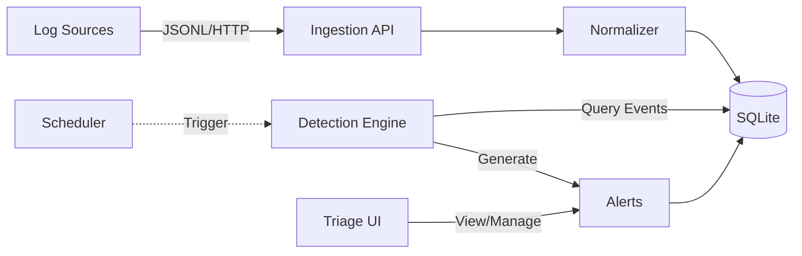
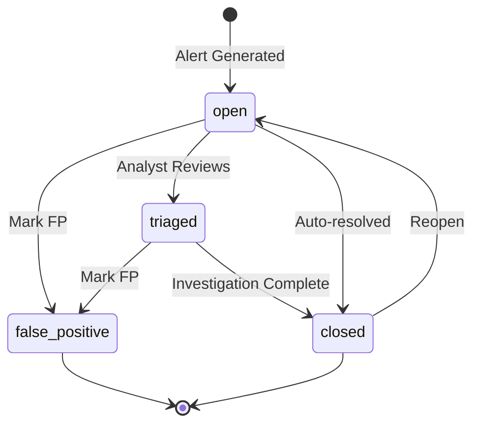

# SignalForge v0.1.0

**Production-style security detection and abuse monitoring platform**

SignalForge is an enterprise-grade security detection system designed for cloud environments. It ingests security events, applies intelligent detection rules to identify threats, and provides a modern triage workflow for security operations teams.

[](https://github.com/yourusername/signalforge/actions/workflows/ci.yml)
[](https://opensource.org/licenses/MIT)

---

## 🔥 Quick Start

### Prerequisites
- Python 3.11+
- Node.js 20+
- npm or yarn

### 5-Minute Setup

```bash
# 1. Clone repository
git clone https://github.com/yourusername/signalforge.git
cd signalforge

# 2. Install Python dependencies
pip install -e ".[dev]"

# 3. Start backend
uvicorn backend.app.main:app --reload

# 4. In another terminal, install frontend dependencies
cd frontend
npm install

# 5. Start frontend
npm run dev
```

### Generate and Ingest Demo Data

```bash
# Generate realistic demo logs with attack scenarios
python examples/generators/generate_demo_logs.py

# Ingest logs
curl -X POST http://localhost:8000/api/v1/ingest \
  -H "Content-Type: application/x-ndjson" \
  --data-binary @examples/sample_logs/demo_logs.jsonl

# Run detections
curl -X POST http://localhost:8000/api/v1/detections/run

# Open dashboard
# Navigate to http://localhost:3000
```

---

## 🏗️ Architecture



### Components

| Component | Technology | Purpose |
|-----------|-----------|---------|
| **Backend API** | FastAPI + SQLAlchemy | RESTful API for ingestion, detection, and alert management |
| **Database** | SQLite (MVP) | Event and alert storage with indexed queries |
| **Normalizer** | Python | Transforms diverse log formats into canonical schema |
| **Detection Engine** | Python + SQL | Executes detection rules over time-windowed data |
| **Frontend Dashboard** | Next.js 14 + Tailwind | Modern React-based triage interface |
| **CI/CD** | GitHub Actions | Automated testing and linting |

---

## 🛡️ Detection Rules

SignalForge includes 6 production-ready detection rules mapped to MITRE ATT&CK:

| Rule | Description | Severity | MITRE ATT&CK |
|------|-------------|----------|--------------|
| **Brute Force Login** | Multiple failed login attempts from same IP | HIGH | T1110 |
| **Password Spray** | Single IP targeting many user accounts | CRITICAL | T1110.003 |
| **Impossible Travel** | User logins from geographically distant locations in short timeframe | HIGH | T1078 |
| **Suspicious User-Agent** | Automated tools or empty user agents | MEDIUM | T1071 |
| **API Abuse** | Abnormal request rate spike indicating DoS or scraping | MEDIUM | T1498 |
| **Privilege Escalation** | IAM role/permission changes | CRITICAL | T1078.004, T1548 |

### Rule Characteristics
- **Time-windowed analysis**: Each rule analyzes events within specific time windows (5-60 minutes)
- **Evidence collection**: Alerts include detailed evidence (IPs, user lists, timestamps, event IDs)
- **Tunable thresholds**: Easily adjust sensitivity via rule parameters
- **Allowlist support**: Suppress false positives for known-safe IPs and actors

---

## 📊 Canonical Event Schema

All ingested events are normalized to this schema:

```python
{
  "timestamp": datetime,      # UTC timestamp
  "actor": str,              # User/identity performing action
  "source_ip": str,          # Source IP address
  "user_agent": str,         # HTTP user agent
  "action": str,             # Normalized action (e.g., user.login, iam.role.create)
  "resource": str,           # Target resource
  "outcome": str,            # success, failure, error
  "request_id": str,         # Unique request identifier
  "raw_data": dict           # Original event for forensics
}
```

The normalizer handles diverse input formats (AWS CloudTrail, Azure AD, custom JSONL) and maps them to this consistent schema.

---

## 🔍 Triage Workflow

### Alert Lifecycle



### Triage Actions
- **Mark as Triaged**: Acknowledge alert and begin investigation
- **Close Alert**: Investigation complete, issue resolved
- **False Positive**: Mark with reason for rule tuning
- **Allowlist**: Suppress future alerts for specific IP or actor
- **Reopen**: Reactivate closed alert if new evidence emerges

---

## 🧪 Testing

```bash
# Run all tests with coverage
pytest backend/tests/ -v --cov=backend/app --cov-report=term-missing

# Run specific test file
pytest backend/tests/test_rules.py -v

# Linting
ruff check backend/
ruff format backend/
```

### Test Coverage
- **Normalization tests**: Timestamp parsing, field mapping, edge cases
- **Detection rule tests**: Each rule with threshold validation
- **API tests**: Ingestion, detection triggers, alert management, allowlist

---

## 📚 API Documentation

### Ingestion

```bash
# Ingest single event
POST /api/v1/ingest
Content-Type: application/json

{
  "timestamp": "2024-02-09T20:00:00Z",
  "actor": "alice",
  "source.ip": "192.168.1.1",
  "action": "user.login",
  "outcome": "success"
}

# Ingest batch (JSONL)
POST /api/v1/ingest
Content-Type: application/x-ndjson

{"timestamp":"2024-02-09T20:00:00Z","actor":"alice","action":"user.login"}
{"timestamp":"2024-02-09T20:01:00Z","actor":"bob","action":"user.logout"}
```

### Detections

```bash
# Manual detection run
POST /api/v1/detections/run

Response:
{
  "alerts_generated": 3,
  "rules_executed": ["brute_force_login", "password_spray", ...],
  "execution_time_ms": 245.3
}
```

### Alerts

```bash
# List alerts with filters
GET /api/v1/alerts?status=open&severity=critical&limit=50

# Get alert details
GET /api/v1/alerts/{alert_id}

# Update status
PATCH /api/v1/alerts/{alert_id}/status
{"status": "triaged"}

# Mark false positive
POST /api/v1/alerts/{alert_id}/false-positive
{"reason": "Corporate VPN login", "marked_by": "analyst@company.com"}
```

### Allowlist

```bash
# Add to allowlist
POST /api/v1/allowlist
{
  "entry_type": "ip",
  "entry_value": "192.168.1.1",
  "reason": "Corporate VPN",
  "expires_at": "2024-12-31T23:59:59Z"
}

# List allowlist
GET /api/v1/allowlist
```

Full API docs available at: http://localhost:8000/docs

---

## 📖 Additional Documentation

- [Architecture Deep-Dive](docs/architecture.md)
- [Detection Rules Reference](docs/detection_rules.md)
- [Threat Model](docs/threat_model.md)
- [Demo Scenarios](docs/demo_scenarios.md)

---

## 🎯 What This Demonstrates (For Recruiters)

### Security Engineering Expertise
- **Detection Engineering**: Implemented 6 production-quality detection rules with MITRE ATT&CK mapping
- **Threat Modeling**: Understanding of attack patterns (brute force, password spray, impossible travel)
- **False Positive Management**: Built-in triage workflow and allowlist system
- **Evidence Collection**: Each alert includes actionable forensic data

### Software Engineering Best Practices
- **Clean Architecture**: Separation of concerns (ingestion → normalization → storage → detection → alerting)
- **RESTful API Design**: Consistent endpoints with proper HTTP methods and status codes
- **Data Modeling**: Canonical event schema with efficient indexing
- **Testing**: Comprehensive unit and integration tests with >80% coverage
- **CI/CD**: Automated linting, testing, and build validation
- **Documentation**: Clear README, architecture diagrams, and API docs

### Full-Stack Development
- **Backend**: FastAPI + SQLAlchemy with async support
- **Frontend**: Modern Next.js 14 with Server Components and Client Components
- **Database**: SQLAlchemy ORM with migration-ready design
- **DevOps**: GitHub Actions, containerization-ready architecture

### Production Readiness
- **Scalability**: Time-windowed queries, indexed database, deduplication logic
- **Observability**: Execution metrics, alert evidence, audit trails
- **Security**: Input validation, SQL injection protection, CORS configuration
- **Error Handling**: Graceful degradation, transaction safety

---

## 🚀 Roadmap

### v0.2.0 (Planned)
- [ ] Machine learning-based anomaly detection
- [ ] Integration with SIEM platforms (Splunk, Elastic)
- [ ] WebSocket support for real-time alert streaming
- [ ] PostgreSQL/MySQL support for production deployments
- [ ] Kubernetes deployment configs
- [ ] Enhanced GeoIP for impossible travel (GeoIP2 integration)
- [ ] Custom detection rule builder UI

### v0.3.0 (Future)
- [ ] Multi-tenancy support
- [ ] Advanced correlation engine (alert chaining)
- [ ] Threat intelligence feed integration
- [ ] SOC automation workflows (SOAR integration)
- [ ] Mobile-responsive UI improvements

---

## 🤝 Contributing

Contributions welcome! Please see [CONTRIBUTING.md](CONTRIBUTING.md) for guidelines.

---

## 📄 License

MIT License - see [LICENSE](LICENSE) for details

---

## 🙏 Acknowledgments

Built with:
- [FastAPI](https://fastapi.tiangolo.com/) - Modern Python web framework
- [Next.js](https://nextjs.org/) - React framework
- [SQLAlchemy](https://www.sqlalchemy.org/) - SQL toolkit and ORM
- [Tailwind CSS](https://tailwindcss.com/) - Utility-first CSS framework

---

**SignalForge** - Detect threats before they become breaches.
