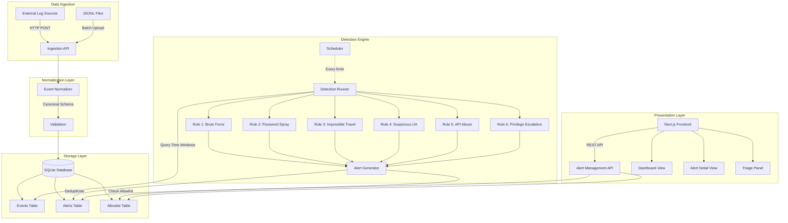
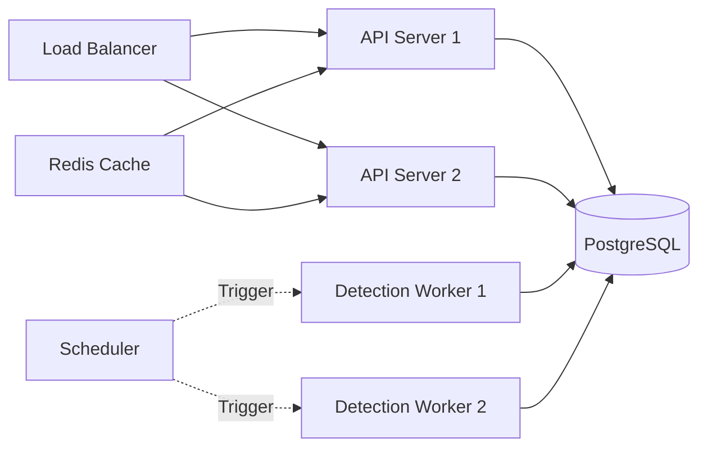

# SignalForge Architecture

## System Overview

SignalForge is a security detection and abuse monitoring platform designed for cloud environments. It follows a pipeline architecture: **Ingest → Normalize → Store → Detect → Alert → Triage**.

## Architecture Diagram



## Component Details

### 1. Ingestion API (`backend/app/routers/ingest.py`)

**Responsibilities:**
- Accept events via HTTP POST (single or batch)
- Support multiple content types (JSON, JSONL)
- Return ingestion summary with event IDs

**Scaling Considerations:**
- In production, use message queue (Kafka, RabbitMQ) for async ingestion
- Implement rate limiting to prevent DoS
- Add authentication/API keys for source verification

### 2. Event Normalizer (`backend/app/services/normalizer.py`)

**Responsibilities:**
- Parse various timestamp formats (ISO8601, Unix epoch, RFC3339)
- Extract fields from different log formats (AWS CloudTrail, Azure AD, custom)
- Map action names to canonical format
- Normalize outcomes to success/failure/error

**Field Mapping Examples:**
```python
source_ip: "source_ip" | "sourceIP" | "client_ip" | "source.ip"
actor: "actor" | "user" | "username" | "identity.principalId"
action: "login" → "user.login", "CreateRole" → "iam.role.create"
```

### 3. Storage Layer (SQLite + SQLAlchemy)

**Database Schema:**

```sql
-- Events: Canonical security events
CREATE TABLE events (
    id INTEGER PRIMARY KEY,
    timestamp DATETIME NOT NULL,
    actor VARCHAR(255),
    source_ip VARCHAR(45),
    user_agent TEXT,
    action VARCHAR(255) NOT NULL,
    resource VARCHAR(512),
    outcome VARCHAR(50),
    request_id VARCHAR(255),
    raw_data JSON,
    created_at DATETIME DEFAULT CURRENT_TIMESTAMP,
    INDEX idx_timestamp (timestamp),
    INDEX idx_actor (actor),
    INDEX idx_source_ip (source_ip),
    INDEX idx_action (action),
    INDEX idx_outcome (outcome)
);

-- Alerts: Detection rule outputs
CREATE TABLE alerts (
    id INTEGER PRIMARY KEY,
    rule_id VARCHAR(100) NOT NULL,
    severity VARCHAR(20) NOT NULL,
    status VARCHAR(20) NOT NULL DEFAULT 'open',
    summary TEXT NOT NULL,
    evidence JSON NOT NULL,
    alert_time DATETIME NOT NULL,
    window_start DATETIME,
    window_end DATETIME,
    created_at DATETIME DEFAULT CURRENT_TIMESTAMP,
    updated_at DATETIME DEFAULT CURRENT_TIMESTAMP,
    INDEX idx_rule_id (rule_id),
    INDEX idx_severity (severity),
    INDEX idx_status (status),
    INDEX idx_alert_time (alert_time)
);

-- Allowlist: Suppress known-safe entities
CREATE TABLE allowlist (
    id INTEGER PRIMARY KEY,
    entry_type VARCHAR(20) NOT NULL,  -- 'ip' or 'actor'
    entry_value VARCHAR(255) NOT NULL,
    reason TEXT NOT NULL,
    rule_id VARCHAR(100),  -- Optional: allowlist for specific rule
    expires_at DATETIME,
    created_by VARCHAR(255),
    created_at DATETIME DEFAULT CURRENT_TIMESTAMP,
    INDEX idx_entry_type_value (entry_type, entry_value)
);

-- False Positives: Track for rule tuning
CREATE TABLE false_positives (
    id INTEGER PRIMARY KEY,
    alert_id INTEGER NOT NULL,
    reason TEXT NOT NULL,
    marked_by VARCHAR(255),
    marked_at DATETIME DEFAULT CURRENT_TIMESTAMP
);
```

**Index Strategy:**
- **Time-based queries**: Index on `timestamp`, `alert_time` for window queries
- **Filtering**: Index on `actor`, `source_ip`, `action`, `outcome`, `status`, `severity`
- **Lookups**: Index on `entry_type + entry_value` for allowlist checks

**Migration to Production DB:**
- SQLite is MVP-suitable for <100K events/day
- For production, migrate to PostgreSQL or MySQL
- Use Alembic for schema migrations
- Consider TimescaleDB for time-series optimization

### 4. Detection Engine (`backend/app/services/detection_engine.py`)

**Workflow:**

1. **Scheduled Execution** (every 5 minutes via APScheduler)
2. **Calculate Time Windows** (based on rule's `window_minutes`)
3. **Execute Each Rule** sequentially
4. **Generate Alerts** with evidence collection
5. **Allowlist Check** (suppress if IP/actor allowlisted)
6. **Deduplication** (suppress if same rule + entity recently alerted)

**Detection Rule Interface:**

```python
class DetectionRule(ABC):
    @property
    def rule_id(self) -> str: ...
    
    @property
    def window_minutes(self) -> int: ...
    
    def detect(self, db, window_start, window_end) -> list[dict]:
        # Returns list of alert dictionaries
        pass
```

**Deduplication Logic:**
- If same `rule_id` triggered in last 1 hour, suppress
- In production, implement fingerprinting (hash evidence)

**Scaling Considerations:**
- Parallel rule execution (thread pool or async)
- Incremental detection (track last processed timestamp)
- Distributed detection (multiple workers with job queue)

### 5. Alert Management API (`backend/app/routers/alerts.py`)

**Endpoints:**
- `GET /api/v1/alerts` - List with filters
- `GET /api/v1/alerts/{id}` - Get details
- `PATCH /api/v1/alerts/{id}/status` - Update status
- `POST /api/v1/alerts/{id}/false-positive` - Mark FP
- `POST /api/v1/allowlist` - Add allowlist entry
- `DELETE /api/v1/allowlist/{id}` - Remove entry

**Status State Machine:**
```
open → triaged → closed
  ↓       ↓
false_positive
  ↓       ↓
open (reopen)
```

### 6. Frontend Dashboard (Next.js 14)

**Pages:**
- `/` - Dashboard with stats and alert list
- `/alerts/[id]` - Alert detail with evidence and triage

**Components:**
- `AlertCard` - Summary card for list view
- `SeverityBadge` - Color-coded severity indicator
- `StatusBadge` - Status indicator
- `EvidenceViewer` - Formatted evidence display
- `TriagePanel` - Status update controls

**State Management:**
- Simple useState/useEffect (no Redux needed for MVP)
- Polling every 30 seconds for auto-refresh
- Optimistic updates for triage actions

## Data Flow Example

### Scenario: Brute Force Attack Detection

1. **Ingestion**: 15 failed login events from `192.168.1.100` arrive via `/api/v1/ingest`
2. **Normalization**: Events normalized to canonical schema, stored in `events` table
3. **Detection**: Scheduled run queries last 15 minutes
   - Brute Force rule groups by `source_ip`
   - Finds 15 failures from `192.168.1.100` (threshold: 5)
4. **Alert Generation**: Creates alert with evidence:
   ```json
   {
     "rule_id": "brute_force_login",
     "severity": "high",
     "summary": "Brute force attack: 15 failed logins from 192.168.1.100",
     "evidence": {
       "source_ip": "192.168.1.100",
       "attempt_count": 15,
       "event_ids": [1, 2, 3, ...],
       "targeted_users": ["alice"]
     }
   }
   ```
5. **Allowlist Check**: Checks if `192.168.1.100` is allowlisted → not found
6. **Deduplication**: No recent alert for same IP → proceed
7. **Storage**: Alert saved to `alerts` table with status `open`
8. **UI Update**: Next poll (30s) fetches new alert, displays on dashboard
9. **Triage**: Analyst marks as `triaged`, investigates, then closes

## Security Considerations

### Input Validation
- Pydantic schemas validate all API inputs
- SQL injection prevented via SQLAlchemy ORM
- JSON payloads limited to 1MB to prevent memory exhaustion

### Authentication & Authorization
- MVP: No auth (internal tool assumption)
- Production: Add JWT authentication, API keys, role-based access control

### Rate Limiting
- Production: Implement per-IP rate limits on ingestion endpoint
- Use nginx or Cloudflare for DDoS protection

## Performance Characteristics

### Benchmarks (MVP on single host)

| Metric | Performance |
|--------|-------------|
| Ingestion throughput | ~1000 events/sec |
| Detection latency | 5-10 seconds for 100K events |
| Alert retrieval | <100ms for filtered queries |
| Database size | ~1MB per 10K events |

### Bottlenecks
- SQLite write concurrency (single writer)
- Detection rules query full table (no incremental processing)
- Frontend polling creates unnecessary load

### Optimization Path
1. **Database**: Migrate to PostgreSQL (concurrent writes, better indexing)
2. **Detection**: Implement incremental processing (last_processed_timestamp)
3. **Frontend**: WebSocket for real-time updates instead of polling
4. **Caching**: Redis for frequently accessed alerts

## Deployment Architecture (Production)



**Components:**
- **Load Balancer**: Nginx or ALB for traffic distribution
- **API Servers**: Multiple FastAPI instances (horizontal scaling)
- **Detection Workers**: Separate processes for rule execution
- **PostgreSQL**: Primary datastore with replication
- **Redis**: Cache for alert counts, recent alerts
- **Scheduler**: Airflow or Temporal for detection orchestration

## Monitoring & Observability

### Metrics to Track
- Ingestion rate (events/sec)
- Detection execution time per rule
- Alert generation rate
- False positive rate
- Triage time (open → closed)

### Logging
- Structured JSON logs (timestamp, level, message, context)
- Log ingestion errors for debugging
- Log detection failures for rule tuning

### Alerting
- Alert on detection engine failures
- Alert on ingestion API errors
- Alert on database connection failures
